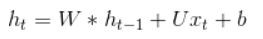
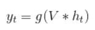
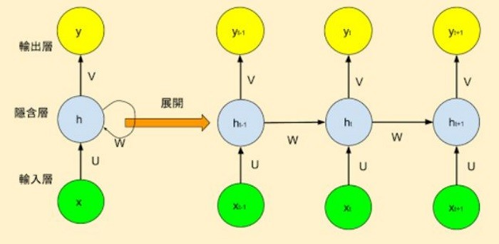
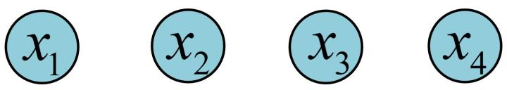
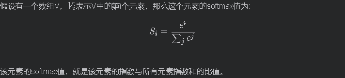

# Recuuent Neural Network-循環神經網路 介紹

## 大綱

### RNN 簡介

### RNN 圖解

## SoftMax function

### RNN Demo

---

## RNN 簡介

語言通常要考慮前言後語，以免斷章取義，也就是說，建立語言的相關模型，如果能額外考慮上下文的關係，準確率就會顯著提高，因此，學者提出『循環神經網路』(Recurrent Neural Network, RNN)演算法，它是『自然語言處理』領域最常使用的 Neural Network 模型

簡單的RNN模型(Vanilla RNN)額外考慮前文的關係，把簡單迴歸的模型 (y=W*x+b) ，改為下列公式，其中h就是預測值(y)，同樣，將它加一個 Activation Function(通常使用 tanh)，就變成第二個公式

---

## RNN 簡介

也就是說，當前 output 不只受上一層輸入的影響，也受到同一層前一個 output 的影響(即前文)，類似統計學的『時間數列』(Time Series)，這個假設很合理，例如下面這兩個句子：

圖片來源 [Ashing's Blog_ 深度學習(3)--循環神經網絡(RNN, Recurrent Neural Networks)](http://arbu00.blogspot.tw/2017/05/3-rnn-recurrent-neural-networks.html)

---

## RNN 圖解

最基本的单层网络结构，输入是`$x$`，经过变换`Wx+b`和激活函数`f`得到输出`y`： 

---

在实际应用中，我们还会遇到很多序列形的数据，如： 

自然语言处理问题。x1可以看做是第一个单词，x2可以看做是第二个单词，依次类推。 

语音处理。此时，x1、x2、x3……是每帧的声音信号。 

时间序列问题。例如每天的股票价格等等。  其单个序列如下图所示：

---

 前面介绍了诸如此类的序列数据用原始的神经网络难以建模，基于此，RNN引入了隐状态*ℎ*（hidden state），*ℎ*•可对序列数据提取特征，接着再转换为输出。  为了便于理解，先计算*ℎ*1•： 

---

图中的圆圈表示向量，箭头表示对向量做变换。  RNN中，每个步骤使用的参数`$U,W,b$`•相同，`$h_2$`的计算方式和`$h_1•$`类似，其计算结果如下： 

---

计算*ℎ*3,*ℎ*4•也相似，可得： 

---

 接下来，计算RNN的输出*𝑦*1，采用*𝑆**𝑜**𝑓**𝑡**𝑚**𝑎**𝑥*作为激活函数，根据*𝑦**𝑛*=*𝑓*(*𝑊**𝑥*+*𝑏*)，得*𝑦*1•:

---

 使用和*𝑦*1•相同的参数*𝑉*,*𝑐*•，得到*𝑦*1,*𝑦*2,*𝑦*3,*𝑦*4•的输出结构： 

 以上即为最经典的RNN结构，其输入为*𝑥*1,*𝑥*2,*𝑥*3,*𝑥*4，输出为*𝑦*1,*𝑦*2,*𝑦*3,*𝑦*4，当然实际中最大值为*𝑦**𝑛*，这里为了便于理解和展示，只计算4个输入和输出。从以上结构可看出，RNN结构的输入和输出等长。 

---

## Softmax 

在机器学习尤其是深度学习中，softmax是个非常常用而且比较重要的函数，尤其在多分类的场景中使用广泛。他把一些输入映射为0-1之间的实数，并且归一化保证和为1，因此多分类的概率之和也刚好为1

---

## Softmax

---

## RNN Demo

---

---

ref

https://ithelp.ithome.com.tw/articles/10193469

https://ithelp.ithome.com.tw/articles/10204741