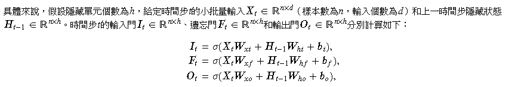
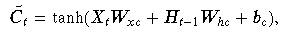
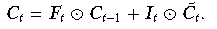
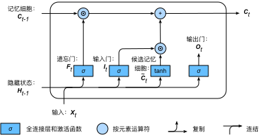
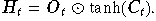
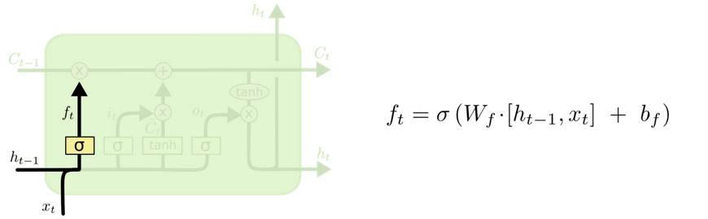
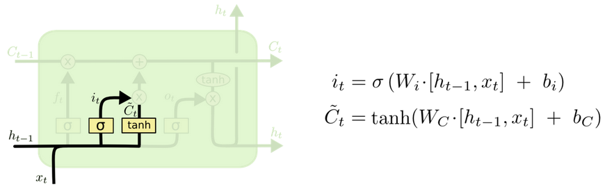
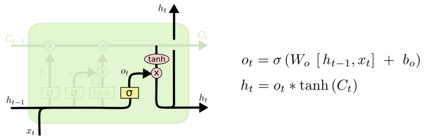

# Long/Short Term Memory（LSTM） Model 

## Outline

1. LSTM 簡介
2. LSTM結構
3. LSTM圖解
4. Demo code

---

### 1.LSTM簡介

所有 RNN 都具有一種重覆神經網絡模塊的鏈式的形式。在標準的 RNN 中，這個重覆的模塊只有一個非常簡單的結構，例如一個 tanh 層，如下圖所示：

---

## 1. LSTM簡介

之前提過的RNN有個明確的缺點，無法捕捉長期時間（當序列的距離太大）之間的關聯。

簡單的 RNN 結構無法處理隨著遞歸權重指數級爆炸或消失的問題（Vanishing gradient problem）。

基於上述 RNN 的限制，可以透過 RNN 的變形，也就是 LSTM 來解決。

LSTM 的特色是能夠學習長距離的依賴關係（Long-Term Dependencies），它不同於 RNN 有個單一的神經網絡層（`tanh`），而是有四個層，以特別的方式進行溝通，如圖：

---

## 2. LSTM結構

### 2.1 輸入門 遺忘門 輸出門

LSTM 中引入了3個門，即輸入門（input gate）、遺忘門（forget gate）和輸出門（output gate），以及與隱藏狀態形狀相同的記憶細胞（某些文獻把記憶細胞當成一種特殊的隱藏狀態），從而記錄額外的信息。

長短期記憶的門的輸入均為當前時間步輸入**𝑿**𝑡*與上一時間步隱藏狀態**𝑯***𝑡−1，輸出由激活函數為sigmoid函數的全連接層計算得到。

---

### 2.1 輸入門 遺忘門 輸出門

---

### 2.2 候選記憶細胞

接下來，長短期記憶需要計算候選記憶細胞**𝑪**̃ *𝑡*。它的計算與上面介紹的3個門類似，但使用了值域在[−1,1]的tanh函數作為激活函數，時間步*𝑡*的候選記憶細胞計算:

---

### 2.3記憶細胞

我們可以通過元素值域在[0,1]的輸入門、遺忘門和輸出門來控制隱藏狀態中信息的流動，這一般也是通過使用按元素乘法（符號為⊙）來實現的。當前時間步記憶細胞**𝑪**𝑡*∈ ℝ*𝑛*×*ℎ的計算組合了上一時間步記憶細胞和當前時間步候選記憶細胞的信息，並通過遺忘門和輸入門來控制信息的流動：

---

### 2.3記憶細胞

遺忘門控制上一時間步的記憶細胞**𝑪**𝑡*−1中的信息是否傳遞到當前時間步，而輸入門則控制當前時間步的輸入**𝑿***𝑡通過候選記憶細胞**𝑪**̃ *𝑡*如何流入當前時間步的記憶細胞。如果遺忘門一直近似1且輸入門一直近似0，過去的記憶細胞將一直通過時間保存並傳遞至當前時間步。這個設計可以應對循環神經網絡中的梯度衰減問題，並更好地捕捉時間序列中時間步距離較大的依賴關系。

---

### 2.4隱藏狀態

有了記憶細胞以後，接下來我們還可以通過輸出門來控制從記憶細胞到隱藏狀態**𝑯**𝑡*∈ℝ*𝑛*×*ℎ的信息的流動：

要注意的是，當輸出門近似1時，記憶細胞信息將傳遞到隱藏狀態供輸出層使用；當輸出門近似0時，記憶細胞信息只自己保留。

---

### 3.LSTM圖解

### 3.LSTM圖解 - 核心思想

LSTM 的關鍵就是細胞狀態，水平線在圖上方貫穿運行。細胞狀態類似於傳送帶。直接在整個鏈上運行，只有一些少量的線性交互。信息在上面流傳保持不變會很容易。示意圖如下所示：

---

### 3.LSTM圖解-Forget-gate 忘記門

​    作用對象：細胞狀態 。

​    作用：將細胞狀態中的信息選擇性的遺忘。

​    操作步驟：該門會讀取*ℎ𝑡*−1 和*𝑥*𝑡*，輸出一個在 0 到 1 之間的數值給每個在細胞狀態𝐶*𝑡−1中的數字。1 表示“完全保留”，0 表示“完全舍棄”。示意圖如下

---

### 3.LSTM圖解-Input-gate 輸入門

​    作用對象：細胞狀態 

​    作用：將新的信息選擇性的記錄到細胞狀態中。

​    操作步驟： 

​						步驟1.sigmoid 層稱 “輸入門層” 決定什麽值我們將要更新。

​						步驟2.tanh 層創建一個新的候選值向量*𝐶*̃ *𝑡*加入到狀態中。

---

### 3.LSTM圖解-Input-gate 輸入門

​		步驟3：將*𝑐𝑡*−1更新為*𝑐𝑡*。將舊狀態與*𝑓𝑡*相乘，丟棄掉我們確定需要丟棄的信息。接著加上*𝑖𝑡*∗*𝐶*̃ *𝑡*得到新的候選值，根據我們決定更新每個狀態的程度進行變化。：

---

### 3.LSTM圖解-Output-gate 輸出門

作用對象：隱層*ℎ𝑡*

​    作用：確定輸出什麽值。

​    操作步驟：

​    步驟一：通過sigmoid 層來確定細胞狀態的哪個部分將輸出。

​    步驟二：把細胞狀態通過 tanh 進行處理，並將它和 sigmoid 門的輸出相乘，最終我們僅僅會輸出我們確定輸出的那部分。

---

4.Demo Code

