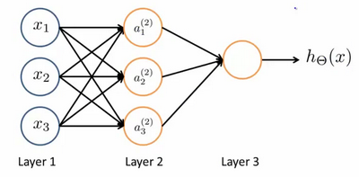

# 類神經網路介紹

---

## 大綱:

### 1.類神經網路介紹

### 2. 常用框架

### 3.簡單類神經網路實作 Demo

### 4. 補充(10月搞炸的BERT)

---


## 1.類神經網路介紹

### 1.1神經元架構


Dendrite/樹突(input)

Axon/軸突(output)

Nucleus(activate,compute)

这里是一条连接到输入神经，或者连接另一个神经元树突的神经，接下来这个神经元接收这条消息，做一些计算，它有可能会反过来将在轴突上的自己的消息传给其他神经元。这就是所有人类思考的模型：我们的神经元把自己的收到的消息进行计算，并向其他神经元传递消息。这也是我们的感觉和肌肉运转的原理。如果你想活动一块肌肉，就会触发一个神经元给你的肌肉发送脉冲，并引起你的肌肉收缩。如果一些感官：比如说眼睛想要给大脑传递一个消息，那么它就像这样发送电脉冲给大脑的


### 1.2定義

類神經網路是一種模仿生物神經系統的數學模型。


神经网络模型建立在很多神经元之上，每一个神经元又是一个个学习模型。这些神经元（也叫激活单元，activation  unit）采纳一些特征作为输出，并且根据本身的模型提供一个输出。

图是一个以逻辑回归模型作为自身学习模型的神经元示例，在神经网络中，参数又可被成为权重（weight)

---


---

### 1.3 最簡單的神經網路架構



其中,x1,x2,x3 是输入单元（input units），我们将原始数据输入给它们。 a1,a2,a3 是中间单元，它们负责将数据进行处理，然后呈递到下一层。 最后是输出单元，它负责计算h(x)。

---

### 1.3 最簡單的神經網路架構


神经网络模型是许多逻辑单元按照不同层级组织起来的网络，每一层的输出变量都是下一层的输入变量。下图为一个3层的神经网络，第一层成为输入层（Input Layer），最后一层称为输出层（Output Layer），中间一层成为隐藏层（Hidden  Layers）。我们为每一层都增加一个偏差单位（bias unit）

对于上图所示的模型，激活单元和输出分别表达为：


---

### 1.4 前向傳播

上面进行的讨论中只是将特征矩阵中的一行（一个训练实例）喂给了神经网络，我们需要将整个训练集都喂给我们的神经网络算法来学习模型。

我们可以知道：每一个a都是由上一层所有的x和每一个x所对应的w决定的。

我们把这样从左到右的算法称为前向传播算法( FORWARD PROPAGATION )


---

### 1.4 前向傳播

寫成向量格式如下


輸出的值則為:


---

### 1.4 前向傳播

g(x) 圖像: 


---

### 1.5 反向傳播


---

### 1.5 反向傳播

反向传播是根据链式求导法则对参数w,b更新


---


---

## 2.神經網路python 框架

tensorflow 

​	1.x , 2.x 版本 (新版跟舊版的接口差異大)

keras 框架

  高階的 api 框架, 撰寫容易

```python
# 建立簡單的線性執行的模型
model = Sequential()
# Add Input layer, 隱藏層(hidden layer) 有 256個輸出變數
model.add(Dense(units=256, input_dim=784, kernel_initializer='normal', activation='relu')) 
# Add output layer
model.add(Dense(units=10, kernel_initializer='normal', activation='softmax'))
```

---


---

## 3.簡單類神經網路實作 Demo

Ss

---

ref

https://www.stockfeel.com.tw/%E9%A1%9E%E7%A5%9E%E7%B6%93%E7%B6%B2%E8%B7%AF%E7%9A%84%E5%BE%A9%E8%88%88%EF%BC%9A%E6%B7%B1%E5%BA%A6%E5%AD%B8%E7%BF%92%E7%B0%A1%E5%8F%B2/


https://ithelp.ithome.com.tw/articles/10191725