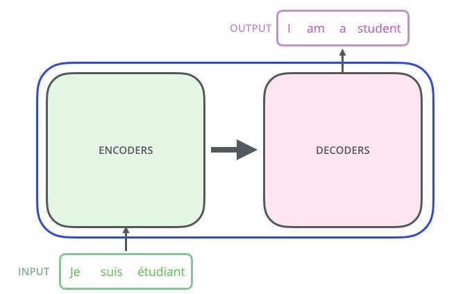
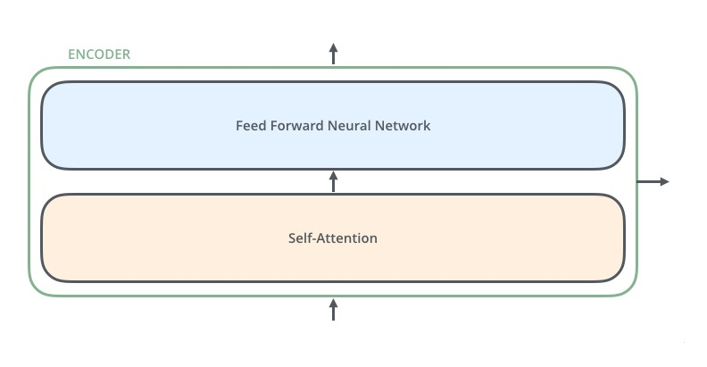
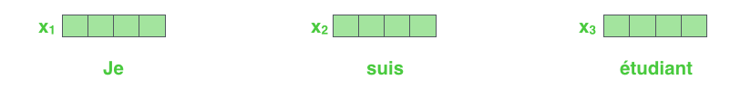
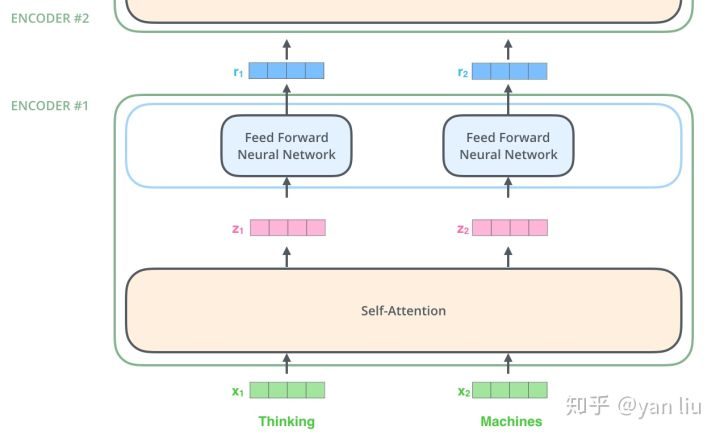
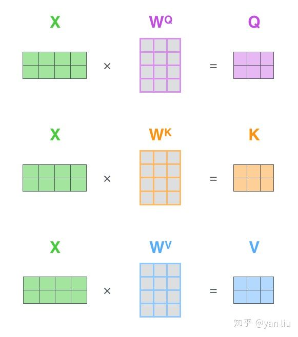
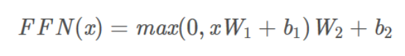

#  Transformer Model

# Transformer 模型 簡介)

## Outline 

### Attention概念 

### Transformer 模型

---

## Attention 概念

### rnn/seq2seq的问题

1.Encoder-Decoder框架在序列到序列模型中有很广泛的应用。但该框架有个潜在的问题就出在编码器产生的源语言上下文向量c上了，一般来说c向量具有两个局限性，

第一个是当输入序列很长的时候，通过循环网络产生的c向量很难表达整句的信息，而是偏向于表达离序列结尾近的信息；另一方面，由于在机器翻译的过程中，需要明确目标语言词汇与源语言词汇的大致对应关系，这样如果所有的解码都用同一个上下文c向量，就很难表现出源语言词汇的具体贡献情况

---

### rnn/seq2seq的问题

以 RNN 為基礎的 Seq2Seq 模型做 NMT 的流程

<video src="img/seq2seq-unrolled-no-attention.mp4"></video>

Seq2Seq 模型裡的一個重要假設是 Encoder 能把輸入句子的語義 / 文本脈絡全都壓縮成**一個**固定維度的語義向量。之後 Decoder 只要利用該向量裡頭的資訊就能重新生成具有相同意義，但不同語言的句子。但你可以想像當我們只有一個向量的時候，是不太可能把一個很長的句子的所有資訊打包起來的

---

### rnn/seq2seq的问题

2.無法有效的平行運算,速度慢.

一個有 4 個元素的輸入序列為例：[a1, a2, a3, a4] ,  要獲得最後一個時間點的輸出向量 `b4` 得把整個輸入序列跑過一遍才行：

---

### 注意力的概念

Attention机制跟人类翻译文章时候的思路有些类似，即将注意力关注于我们翻译部分对应的上下文。

同样的，Attention模型中，当我们翻译当前词语时，我们会寻找源语句中相对应的几个词语，并结合之前的已经翻译的部分作出相应的翻译

---

### 注意力的概念

注意力機制（Attention Mechanism）的中心思想

與其只把 Encoder 處理完句子產生的最後「一個」向量交給 Decoder 並要求其從中萃取整句資訊，不如將 Encoder  在處理每個詞彙後所生成的「所有」輸出向量都交給 Decoder，讓 Decoder 自己決定在生成新序列的時候要把「注意」放在 Encoder  的哪些輸出向量上面

<video src="img/seq2seq-unrolled-with-attention.mp4"></video>

---

### 注意力的概念

Encoder 把處理完每個詞彙所產生的向量都交給 Decoder 了。且透過注意力機制，Decoder 在生成新序列的每個元素時都能**動態地**考慮自己要看哪些 Encoder 的向量（還有決定從中該擷取多少資訊）

<video src="img/seq2seq_detail.mp4"></video>

法翻英時，Decoder 在生成每個英文詞彙時都在 Encoder 的每個輸出向量上放不同的注意程度                        （[圖片來源](https://jalammar.github.io/visualizing-neural-machine-translation-mechanics-of-seq2seq-models-with-attention/)）                                                

---

### 注意力的概念

既然是深度學習，Encoder / Decoder 一般來說都是由多個 [LSTM](http://colah.github.io/posts/2015-08-Understanding-LSTMs/) / [GRU](https://en.wikipedia.org/wiki/Gated_recurrent_unit) 等 RNN Layers 所疊起來的。而注意力機制在這種情境下實際的運作方式如下：

英翻法情境下，Decoder 在第一個時間點進行的注意力機制, 左右兩邊分別是 Encoder 與 Decoder ，縱軸則是多層的神經網路區塊 / 層。

---

### 注意力的概念

注意力機制實際的計算步驟。在 Decoder 的每個時間點，我們都會進行注意力機制以讓 Decoder 從 Encoder 取得語境資訊

1. 拿 Decoder 當下的紅色隱狀態向量 `ht` 跟 Encoder 所有藍色隱狀態向量 `hs` 做比較，利用 `score` 函式計算出 `ht` 對每個 `hs` 的注意程度
2. 以此注意程度為權重，**加權平均**所有 Encoder 隱狀態 `hs` 以取得上下文向量 `context vector`
3. 將此上下文向量與 Decoder 隱狀態結合成一個注意向量 `attention vector` 並作為該時間的輸出
4. 該注意向量會作為 Decoder 下個時間點的輸入

所以稱為注意權重（attention weights），是因為注意力機制可以被視為是一個學習來源語言和目標語言**每一個單詞之間關係**的小型神經網路，而這些權重是該神經網路的參數。

---

### Transformer

### Seq2Seq 模型 + 自注意力機制

谷歌团队近期提出的用于生成词向量的BERT算法在NLP的11项任务中取得了效果的大幅提升，堪称2018年深度学习领域最振奋人心的消息。而BERT算法的最重要的部分便是本文中提出的Transformer的概念  (2014)

Transformer中抛弃了传统的CNN和RNN，整个网络结构完全是由Attention机制组成。更准确地讲，Transformer仅由self-Attenion和Feed Forward Neural Network组成  

以上述机器翻译为例：

---

### Transformer   - 架構

Transformer的本质上是一个Encoder-Decoder的结构

---

### Transformer   - 架構

论文中所设置的，编码器由6个编码block组成，同样解码器是6个解码block组成。与所有的生成模型相同的是，编码器的输出会作为解码器的输入

---

### Transformer   -Encoder 架構

---

### Transformer   -Decoder架構

Decoder的结构如图5所示，它和Encoder的不同之处在于Decoder多了一个Encoder-Decoder Attention，两个Attention分别用于计算输入和输出的权值：

1. Self-Attention：当前翻译和已经翻译的前文之间的关系；
2. Encoder-Decnoder Attention：当前翻译和编码的特征向量之间的关系。

---

### Transformer   - 輸入

首先通过Word2Vec等词嵌入方法将输入语料转化成特征向量(論文裡長度為512,)

在最底层的block中， ![[公式]](img/equation_014.svg) 将直接作为Transformer的输入，而在其他层中，输入则是上一个block的输出。为了画图更简单，我们使用更简单的例子来表示接下来的过程

---

### Transformer   - Self-Attention

Self-Attention结构

对于self-attention来讲，Q(Query), K(Key), V(Value)三个矩阵均来自同一输入，首先我们要计算Q与K之间的点乘，然后为了防止其结果过大，会除以一个尺度标度 ![[公式]](img/equation_square_dk.svg) ，其中 ![[公式]](img/equation_dk.svg) 为一个query和key向量的维度。再利用Softmax操作将其结果归一化为概率分布，然后再乘以矩阵V就得到权重求和的表示。该操作可以表示为 

---

### Transformer   - Self-Attention

在self-attention中，每个单词有3个不同的向量，它们分别是Query向量（ ），Key向量（ ）和Value向量（  ），长度均是64。它们是通过3个不同的权值矩阵由嵌入向量  乘以三个不同的权值矩阵 ， ，  得到，其中三个矩阵的尺寸也是相同的。均是

---

### Transformer   - Self-Attention

那么Query，Key，Value是什么意思呢？它们在Attention的计算中扮演着什么角色呢？我们先看一下Attention的计算方法，整个过程可以分成7步：

1.如上文，将输入单词转化成嵌入向量；

2.根据嵌入向量得到 ![[公式]](img/equation.svg) ， ![[公式]](img/equation_020.svg) ， ![[公式]](img/equation_009.svg) 三个向量；

3.为每个向量计算一个score： ![[公式]](img/equation_score.svg) ；

4.为了梯度的稳定，Transformer使用了score归一化，即除以 ![[公式]](img/equation_square_dk.svg) ；

5.对score施以softmax激活函数；

6.softmax点乘Value值 ![[公式]](img/equation_009.svg) ，得到加权的每个输入向量的评分 ![[公式]](img/equation_009.svg) ；

7.相加之后得到最终的输出结果 ![[公式]](img/equation_z.svg) ： ![[公式]](img/equation_step7.svg) 。

---

---

### Transformer   - Self-Attention

---

### Transformer   - Self-Attention

实际计算过程中是采用基于矩阵的计算方式，那么论文中的 ![[公式]](img/equation_013.svg) ， ![[公式]](img/equation_V.svg) ，的计算方式如图

---

### Transformer   - Self-Attention

总结为如图12所示的矩阵形式:

---

### Transformer   - Self-Attention

內部結構, 最后一点是其采用了[残差网络](https://zhuanlan.zhihu.com/p/42706477) [5]中的short-cut结构，目的当然是解决深度学习中的退化问题

---

### Transformer   - Self-Attention

Query，Key，Value的概念取自于信息检索系统，举个简单的搜索的例子来说。

当你在某电商平台搜索某件商品（年轻女士冬季穿的红色薄款羽绒服）时，你在搜索引擎上输入的内容便是Query，然后搜索引擎根据Query为你匹配Key（例如商品的种类，颜色，描述等），然后根据Query和Key的相似度得到匹配的内容（Value)。

self-attention中的Q，K，V也是起着类似的作用，在矩阵计算中，点积是计算两个矩阵相似度的方法之一，因此式1中使用了 ![[公式]](img/equation_qk.svg) 进行相似度的计算。接着便是根据相似度进行输出的匹配，这里使用了加权匹配的方式，而权值就是query与key的相似度。

---

### Transformer   - Multi-Head Attention

论文更牛逼的地方是给self-attention加入了另外一个机制，被称为“multi-headed”  attention，该机制理解起来很简单，就是说不仅仅只初始化一组Q、K、V的矩阵，而是初始化多组，tranformer是使用了8组，所以最后得到的结果是8个矩阵。

Multi-Head Attention相当于h个不同的self-attention的集成（ensemble），在这里我们以h = 8 举例说明 Multi-Head Attention的输出分成3步：

1. 将数据 X 分别输入到图所示的8个self-attention中，得到8个加权后的特征矩阵 ![[[公式]](img/equation_z_i_1_8.svg) 。
2. 将8个 ![[公式]](img/equation_zi.svg) 按列拼成一个大的特征矩阵；
3. 特征矩阵经过一层全连接后得到输出 ![[公式]](img/equation_big_z.svg) 。

---

### Transformer   - Multi-Head Attention

1.如下,一個詞對應到多個Attention Head(論文裡寫8個,w1 ~ w8)

---

### Transformer   - Multi-Head Attention

特征矩阵经过一层全连接后得到输出 ![[公式]](img/equation_big_z.svg) 。

---

### Transformer   - Multi-Head Attention

3.最後八個注意力的計算結果合併輸出，整個流程如下圖

---

---

### Transformer   - Positional Encoding

transformer给encoder层和decoder层的输入添加了一个额外的向量Positional Encoding作為释输入序列中单词顺序的方法

最后把这个Positional Encoding与embedding的值相加，作为输入送到下一层。

---

### Transformer   - Positional Encoding

---

### Transformer- Decoder

---

### Transformer- Decoder

编码器通过处理输入序列开启工作。顶端编码器的输出之后会变转化为一个包含向量K（键向量）和V（值向量）的注意力向量集。这些向量将被每个解码器用于自身的“编码-解码注意力层”，而这些层可以帮助解码器关注输入序列哪些位置合适

---

### Transformer- Decoder

---

### Transformer- Decoder

整體解碼過程

---

### Transformer- Encoder-Decoder Attention

在完成编码阶段后，则开始解码阶段。解码阶段的每个步骤都会输出一个输出序列（在这个例子里，是英语翻译的句子）的元素。接下来的步骤重复了这个过程，直到到达一个特殊的终止符号，它表示transformer的解码器已经完成了它的输出。

每个步骤的输出在下一个时间步被提供给底端解码器，并且就像编码器之前做的那样，这些解码器会输出它们的解码结果。另外，就像我们对编码器的输入所做的那样，我们会嵌入并添加位置编码给那些解码器，来表示每个单词的位置。

而那些解码器中的自注意力层表现的模式与编码器不同：在解码器中，自注意力层只被允许处理输出序列中更靠前的那些位置。在softmax步骤前，它会把后面的位置给隐去（把它们设为-inf）。这个“编码-解码注意力层”工作方式基本就像多头自注意力层一样，只不过它是通过在它前面的层来创造查询矩阵，并且从编码器的输出中取得键/值矩阵。

---

### Transformer- Masked Self-Attention

Transformer-解码组件Masked Self-Attention在decoder中的attention layer中的attention 部分，和encoder中的attention不同。

输入序列进入到一个masked self-attention中，因为我们在prediction的时候decoder是从左往右地逐个predict，所以在我们做attention的时候，每一个时间步的输入应该只attention到之前的输入，因此我们要像前文所说的那样，通过在attention的系数矩阵的对应位置加上负无穷然后经过softmax函数，来将某些位置的权重mask掉。

---

## Transformer- The Final Linear and Softmax Layer

解码组件最后会输出一个实数向量。我们如何把浮点数变成一个单词？这便是线性变换层要做的工作，它之后就是Softmax层。

线性变换层是一个简单的全连接神经网络，它可以把解码组件产生的向量投射到一个比它大得多的、被称作对数几率（logits）的向量里。

不妨假设我们的模型从训练集中学习一万个不同的英语单词（我们模型的“输出词表”）。

因此对数几率向量为一万个单元格长度的向量——每个单元格对应某一个单词的分数。

接下来的Softmax 层便会把那些分数变成概率（都为正数、上限1.0）。概率最高的单元格被选中，并且它对应的单词被作为这个时间步的输出。

---

### Transformer- The Final Linear and Softmax Layer

---

### Transformer- Feed Forward

Transformer中的feed forward网络可以理解为两个连续的线性变换，这两个变换中间是一个ReLU激活函数：

---

### Transformer - Demo

