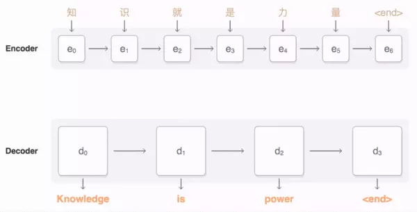
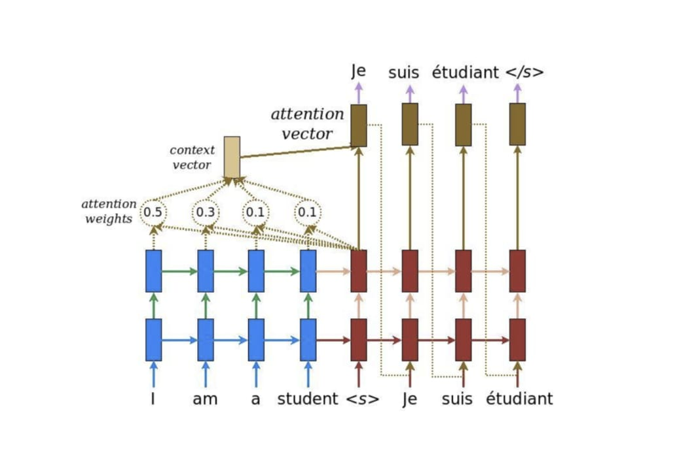

#  Transformer Model

# Transformer 模型 簡介)

## Outline 

### Attention概念 

### Transformer 模型

---

## Attention 概念

### rnn/seq2seq的问题

1Encoder-Decoder框架在序列到序列模型中有很广泛的应用。但该框架有个潜在的问题就出在编码器产生的源语言上下文向量c上了，一般来说c向量具有两个局限性，

第一个是当输入序列很长的时候，通过循环网络产生的c向量很难表达整句的信息，而是偏向于表达离序列结尾近的信息；

另一方面，由于在机器翻译的过程中，需要明确目标语言词汇与源语言词汇的大致对应关系，这样如果所有的解码都用同一个上下文c向量，就很难表现出源语言词汇的具体贡献情况

---

### rnn/seq2seq的问题

以 RNN 為基礎的 Seq2Seq 模型做 NMT 的流程

<video src="img/seq2seq-unrolled-no-attention.mp4"></video>

Seq2Seq 模型裡的一個重要假設是 Encoder 能把輸入句子的語義 / 文本脈絡全都壓縮成**一個**固定維度的語義向量。之後 Decoder 只要利用該向量裡頭的資訊就能重新生成具有相同意義，但不同語言的句子。但你可以想像當我們只有一個向量的時候，是不太可能把一個很長的句子的所有資訊打包起來的

---

### 注意力的概念

Attention机制跟人类翻译文章时候的思路有些类似，即将注意力关注于我们翻译部分对应的上下文。

同样的，Attention模型中，当我们翻译当前词语时，我们会寻找源语句中相对应的几个词语，并结合之前的已经翻译的部分作出相应的翻译

---

### 注意力的概念

注意力機制（Attention Mechanism）的中心思想

與其只把 Encoder 處理完句子產生的最後「一個」向量交給 Decoder 並要求其從中萃取整句資訊，不如將 Encoder  在處理每個詞彙後所生成的「所有」輸出向量都交給 Decoder，讓 Decoder 自己決定在生成新序列的時候要把「注意」放在 Encoder  的哪些輸出向量上面

<video src="img/seq2seq-unrolled-with-attention.mp4"></video>

---

### 注意力的概念

Encoder 把處理完每個詞彙所產生的向量都交給 Decoder 了。且透過注意力機制，Decoder 在生成新序列的每個元素時都能**動態地**考慮自己要看哪些 Encoder 的向量（還有決定從中該擷取多少資訊）

<video src="img/seq2seq_detail.mp4"></video>

法翻英時，Decoder 在生成每個英文詞彙時都在 Encoder 的每個輸出向量上放不同的注意程度                        （[圖片來源](https://jalammar.github.io/visualizing-neural-machine-translation-mechanics-of-seq2seq-models-with-attention/)）                                                

---

既然是深度學習，Encoder / Decoder 一般來說都是由多個 [LSTM](http://colah.github.io/posts/2015-08-Understanding-LSTMs/) / [GRU](https://en.wikipedia.org/wiki/Gated_recurrent_unit) 等 RNN Layers 所疊起來的。而注意力機制在這種情境下實際的運作方式如下：

英翻法情境下，Decoder 在第一個時間點進行的注意力機制, 左右兩邊分別是 Encoder 與 Decoder ，縱軸則是多層的神經網路區塊 / 層。

---

注意力機制實際的計算步驟。在 Decoder 的每個時間點，我們都會進行注意力機制以讓 Decoder 從 Encoder 取得語境資訊

---

### Transformer 

谷歌团队近期提出的用于生成词向量的BERT算法在NLP的11项任务中取得了效果的大幅提升，堪称2018年深度学习领域最振奋人心的消息。而BERT算法的最重要的部分便是本文中提出的Transformer的概念  (2014)

Transformer中抛弃了传统的CNN和RNN，整个网络结构完全是由Attention机制组成。更准确地讲，Transformer由且仅由self-Attenion和Feed Forward Neural Network组成  

以机器翻译为例：

---

