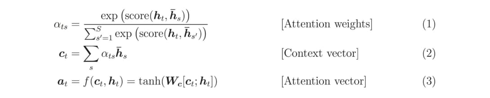

#  Transformer Model

# Transformer 模型 簡介)

## Outline 

### Attention概念 

### Transformer 模型

---

## Attention 概念

### rnn/seq2seq的問題

1.Encoder-Decoder框架在序列到序列模型中有很廣泛的應用。但該框架有個潛在的問題就出在編碼器產生的源語言上下文向量c上了，一般來說c向量具有兩個局限性，

第一個是當輸入序列很長的時候，通過循環網絡產生的c向量很難表達整句的信息，而是偏向於表達離序列結尾近的信息；另一方面，由於在機器翻譯的過程中，需要明確目標語言詞匯與源語言詞匯的大致對應關系，這樣如果所有的解碼都用同一個上下文c向量，就很難表現出源語言詞匯的具體貢獻情況

---

### rnn/seq2seq的問題

以 RNN 為基礎的 Seq2Seq 模型做 NMT 的流程

<video src="img/seq2seq-unrolled-no-attention.mp4"></video>

Seq2Seq 模型裡的一個重要假設是 Encoder 能把輸入句子的語義 / 文本脈絡全都壓縮成**一個**固定維度的語義向量。之後 Decoder 只要利用該向量裡頭的資訊就能重新生成具有相同意義，但不同語言的句子。但你可以想像當我們只有一個向量的時候，是不太可能把一個很長的句子的所有資訊打包起來的

---

### rnn/seq2seq的問題

2.無法有效的平行運算,速度慢.

一個有 4 個元素的輸入序列為例：[a1, a2, a3, a4] ,  要獲得最後一個時間點的輸出向量 `b4` 得把整個輸入序列跑過一遍才行：

---

### 注意力的概念

Attention機制跟人類翻譯文章時候的思路有些類似，即將注意力關注於我們翻譯部分對應的上下文。

同樣的，Attention模型中，當我們翻譯當前詞語時，我們會尋找源語句中相對應的幾個詞語，並結合之前的已經翻譯的部分作出相應的翻譯

---

### 注意力的概念

注意力機制（Attention Mechanism）的中心思想

與其只把 Encoder 處理完句子產生的最後「一個」向量交給 Decoder 並要求其從中萃取整句資訊，不如將 Encoder  在處理每個詞彙後所生成的「所有」輸出向量都交給 Decoder，讓 Decoder 自己決定在生成新序列的時候要把「注意」放在 Encoder  的哪些輸出向量上面

<video src="img/seq2seq-unrolled-with-attention.mp4"></video>

---

### 注意力的概念

Encoder 把處理完每個詞彙所產生的向量都交給 Decoder 了。且透過注意力機制，Decoder 在生成新序列的每個元素時都能**動態地**考慮自己要看哪些 Encoder 的向量（還有決定從中該擷取多少資訊）

<video src="img/seq2seq_detail.mp4"></video>

法翻英時，Decoder 在生成每個英文詞彙時都在 Encoder 的每個輸出向量上放不同的注意程度                        （[圖片來源](https://jalammar.github.io/visualizing-neural-machine-translation-mechanics-of-seq2seq-models-with-attention/)）                                                

---

### 注意力的概念

既然是深度學習，Encoder / Decoder 一般來說都是由多個 [LSTM](http://colah.github.io/posts/2015-08-Understanding-LSTMs/) / [GRU](https://en.wikipedia.org/wiki/Gated_recurrent_unit) 等 RNN Layers 所疊起來的。而注意力機制在這種情境下實際的運作方式如下：

英翻法情境下，Decoder 在第一個時間點進行的注意力機制, 左右兩邊分別是 Encoder 與 Decoder ，縱軸則是多層的神經網路區塊 / 層。

---

### 注意力的概念

注意力機制實際的計算步驟。在 Decoder 的每個時間點，我們都會進行注意力機制以讓 Decoder 從 Encoder 取得語境資訊

1. 拿 Decoder 當下的紅色隱狀態向量 `ht` 跟 Encoder 所有藍色隱狀態向量 `hs` 做比較，利用 `score` 函式計算出 `ht` 對每個 `hs` 的注意程度
2. 以此注意程度為權重，**加權平均**所有 Encoder 隱狀態 `hs` 以取得上下文向量 `context vector`
3. 將此上下文向量與 Decoder 隱狀態結合成一個注意向量 `attention vector` 並作為該時間的輸出
4. 該注意向量會作為 Decoder 下個時間點的輸入

所以稱為注意權重（attention weights），是因為注意力機制可以被視為是一個學習來源語言和目標語言**每一個單詞之間關係**的小型神經網路，而這些權重是該神經網路的參數。

---

### Transformer

### Seq2Seq 模型 + 自注意力機制

谷歌團隊近期提出的用於生成詞向量的BERT算法在NLP的11項任務中取得了效果的大幅提升，堪稱2018年深度學習領域最振奮人心的消息。而BERT算法的最重要的部分便是本文中提出的Transformer的概念  (2014)

Transformer中拋棄了傳統的CNN和RNN，整個網絡結構完全是由Attention機制組成。更準確地講，Transformer僅由self-Attenion和Feed Forward Neural Network組成  

以上述機器翻譯為例：

---

### Transformer   - 架構

Transformer的本質上是一個Encoder-Decoder的結構

---

### Transformer   - 架構

論文中所設置的，編碼器由6個編碼block組成，同樣解碼器是6個解碼block組成。與所有的生成模型相同的是，編碼器的輸出會作為解碼器的輸入

---

### Transformer   - Encoder 架構

---

### Transformer   -Decoder架構

Decoder的結構如圖5所示，它和Encoder的不同之處在於Decoder多了一個Encoder-Decoder Attention，兩個Attention分別用於計算輸入和輸出的權值：

1. Self-Attention：當前翻譯和已經翻譯的前文之間的關系；
2. Encoder-Decoder Attention：當前翻譯和編碼的特征向量之間的關系。

---

### Transformer   - 輸入

首先通過Word2Vec等詞嵌入方法將輸入語料轉化成特征向量(論文裡長度為512,)

在最底層的block中， ![[公式]](img/equation_014.svg) 將直接作為Transformer的輸入，而在其他層中，輸入則是上一個block的輸出。為了畫圖更簡單，我們使用更簡單的例子來表示接下來的過程

---

### Transformer   - Self-Attention

Self-Attention結構

對於self-attention來講，Q(Query), K(Key), V(Value)三個矩陣均來自同一輸入，首先我們要計算Q與K之間的點乘，然後為了防止其結果過大，會除以一個尺度標度 ![[公式]](img/equation_square_dk.svg) ，其中 ![[公式]](img/equation_dk.svg) 為一個query和key向量的維度。再利用Softmax操作將其結果歸一化為概率分布，然後再乘以矩陣V就得到權重求和的表示。該操作可以表示為 

---

### Transformer   - Self-Attention

在self-attention中，每個單詞有3個不同的向量，它們分別是Query向量（ ），Key向量（ ）和Value向量（  ），長度均是64。它們是通過3個不同的權值矩陣由嵌入向量  乘以三個不同的權值矩陣 ， ，  得到，其中三個矩陣的尺寸也是相同的。均是

---

### Transformer   - Self-Attention

那麼Query，Key，Value是什麼意思呢？它們在Attention的計算中扮演著什麼角色呢？我們先看一下Attention的計算方法，整個過程可以分成7步：

1.如上文，將輸入單詞轉化成嵌入向量；

2.根據嵌入向量得到 ![[公式]](img/equation.svg) ， ![[公式]](img/equation_020.svg) ， ![[公式]](img/equation_009.svg) 三個向量；

3.為每個向量計算一個score： ![[公式]](img/equation_score.svg) ；

4.為了梯度的穩定，Transformer使用了score歸一化，即除以 ![[公式]](img/equation_square_dk.svg) ；

5.對score施以softmax激活函數；

6.softmax點乘Value值 ![[公式]](img/equation_009.svg) ，得到加權的每個輸入向量的評分 ![[公式]](img/equation_009.svg) ；

7.相加之後得到最終的輸出結果 ![[公式]](img/equation_z.svg) ： ![[公式]](img/equation_step7.svg) 。

---

---

### Transformer   - Self-Attention

---

### Transformer   - Self-Attention

實際計算過程中是采用基於矩陣的計算方式，那麼論文中的 ![[公式]](img/equation_013.svg) ， ![[公式]](img/equation_V.svg) ，的計算方式如圖

---

### Transformer   - Self-Attention

總結為如圖12所示的矩陣形式:

---

### Transformer   - Self-Attention

內部結構, 最後一點是其采用了[殘差網絡](https://zhuanlan.zhihu.com/p/42706477) [5]中的short-cut結構，目的當然是解決深度學習中的退化問題

---

### Transformer   - Self-Attention

Query，Key，Value的概念取自於信息檢索系統，舉個簡單的搜索的例子來說。

當你在某電商平台搜索某件商品（年輕女士冬季穿的紅色薄款羽絨服）時，你在搜索引擎上輸入的內容便是Query，然後搜索引擎根據Query為你匹配Key（例如商品的種類，顏色，描述等），然後根據Query和Key的相似度得到匹配的內容（Value)。

self-attention中的Q，K，V也是起著類似的作用，在矩陣計算中，點積是計算兩個矩陣相似度的方法之一，因此式1中使用了 ![[公式]](img/equation_qk.svg) 進行相似度的計算。接著便是根據相似度進行輸出的匹配，這里使用了加權匹配的方式，而權值就是query與key的相似度。

---

### Transformer   - Multi-Head Attention

論文更牛逼的地方是給self-attention加入了另外一個機制，被稱為“multi-headed”  attention，該機制理解起來很簡單，就是說不僅僅只初始化一組Q、K、V的矩陣，而是初始化多組，tranformer是使用了8組，所以最後得到的結果是8個矩陣。

Multi-Head Attention相當於h個不同的self-attention的集成（ensemble），在這里我們以h = 8 舉例說明 Multi-Head Attention的輸出分成3步：

1. 將數據 X 分別輸入到圖所示的8個self-attention中，得到8個加權後的特征矩陣 ![[[公式]](img/equation_z_i_1_8.svg) 。
2. 將8個 ![[公式]](img/equation_zi.svg) 按列拼成一個大的特征矩陣；
3. 特征矩陣經過一層全連接後得到輸出 ![[公式]](img/equation_big_z.svg) 。

---

### Transformer   - Multi-Head Attention

1.如下,一個詞對應到多個Attention Head(論文裡寫8個,w1 ~ w8)

---

### Transformer   - Multi-Head Attention

2.特征矩陣經過一層全連接後得到輸出 ![[公式]](img/equation_big_z.svg) 。

---

### Transformer   - Multi-Head Attention

3.最後八個注意力的計算結果合併輸出，整個流程如下圖

---

---

### Transformer - Positional Encoding

transformer給encoder層和decoder層的輸入添加了一個額外的向量Positional Encoding作為釋輸入序列中單詞順序的方法

最後把這個Positional Encoding與embedding的值相加，作為輸入送到下一層。

---

### Transformer   - Positional Encoding

---

### Transformer- Decoder

---

### Transformer- Decoder

編碼器通過處理輸入序列開啟工作。頂端編碼器的輸出之後會變轉化為一個包含向量K（鍵向量）和V（值向量）的注意力向量集。這些向量將被每個解碼器用於自身的“編碼-解碼注意力層”，而這些層可以幫助解碼器關注輸入序列哪些位置合適

---

### Transformer- Decoder

整體解碼過程

---

### Transformer- Encoder-Decoder Attention

在完成編碼階段後，則開始解碼階段。解碼階段的每個步驟都會輸出一個輸出序列（在這個例子里，是英語翻譯的句子）的元素。接下來的步驟重覆了這個過程，直到到達一個特殊的終止符號，它表示transformer的解碼器已經完成了它的輸出。

每個步驟的輸出在下一個時間步被提供給底端解碼器，並且就像編碼器之前做的那樣，這些解碼器會輸出它們的解碼結果。另外，就像我們對編碼器的輸入所做的那樣，我們會嵌入並添加位置編碼給那些解碼器，來表示每個單詞的位置。

而那些解碼器中的自注意力層表現的模式與編碼器不同：在解碼器中，自注意力層只被允許處理輸出序列中更靠前的那些位置。在softmax步驟前，它會把後面的位置給隱去（把它們設為-inf）。這個“編碼-解碼注意力層”工作方式基本就像多頭自注意力層一樣，只不過它是通過在它前面的層來創造查詢矩陣，並且從編碼器的輸出中取得鍵/值矩陣。

---

### Transformer- Masked Self-Attention

Transformer-解碼組件Masked Self-Attention在decoder中的attention layer中的attention 部分，和encoder中的attention不同。

輸入序列進入到一個masked self-attention中，因為我們在prediction的時候decoder是從左往右地逐個predict，所以在我們做attention的時候，每一個時間步的輸入應該只attention到之前的輸入，因此我們要像前文所說的那樣，通過在attention的系數矩陣的對應位置加上負無窮然後經過softmax函數，來將某些位置的權重mask掉。

---

## Transformer- The Final Linear and Softmax Layer

解碼組件最後會輸出一個實數向量。我們如何把浮點數變成一個單詞？這便是線性變換層要做的工作，它之後就是Softmax層。

線性變換層是一個簡單的全連接神經網絡，它可以把解碼組件產生的向量投射到一個比它大得多的、被稱作對數幾率（logits）的向量里。

不妨假設我們的模型從訓練集中學習一萬個不同的英語單詞（我們模型的“輸出詞表”）。

因此對數幾率向量為一萬個單元格長度的向量——每個單元格對應某一個單詞的分數。

接下來的Softmax 層便會把那些分數變成概率（都為正數、上限1.0）。概率最高的單元格被選中，並且它對應的單詞被作為這個時間步的輸出。

---

### Transformer- The Final Linear and Softmax Layer

---

### Transformer- Feed Forward

Transformer中的feed forward網絡可以理解為兩個連續的線性變換，這兩個變換中間是一個ReLU激活函數：

---

### Transformer - Demo

---

### Ref

https://zhuanlan.zhihu.com/p/48508221

https://terrifyzhao.github.io/2019/01/11/Transformer%E6%BA%90%E7%A0%81%E8%A7%A3%E8%AF%BB.html

https://blog.csdn.net/qq_37394634/article/details/102679096

https://blog.csdn.net/qq_37394634/article/details/102679096

https://tensorflow.google.cn/tutorials/text/transformer#create_the_transformer

https://keras.io/examples/nlp/text_classification_with_transformer/

