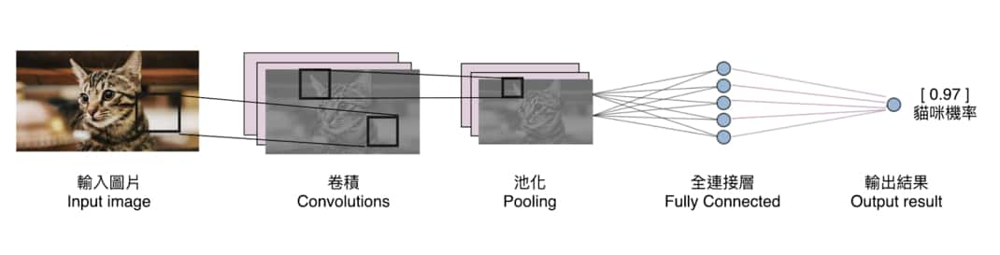
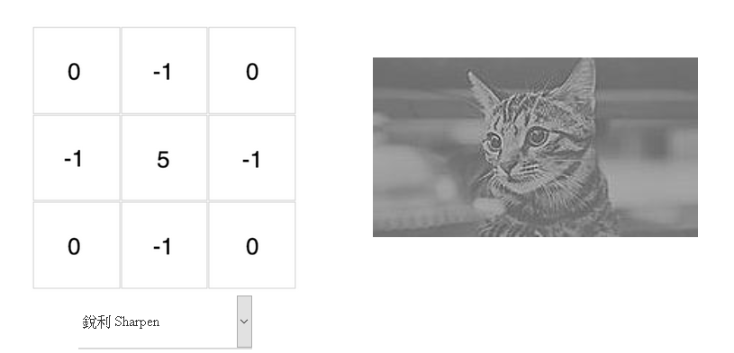
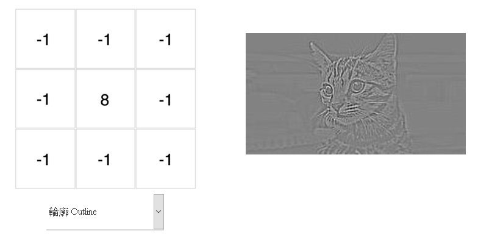
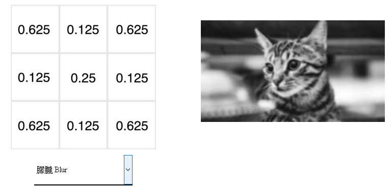
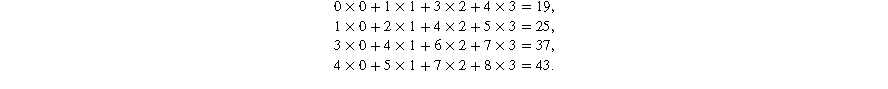
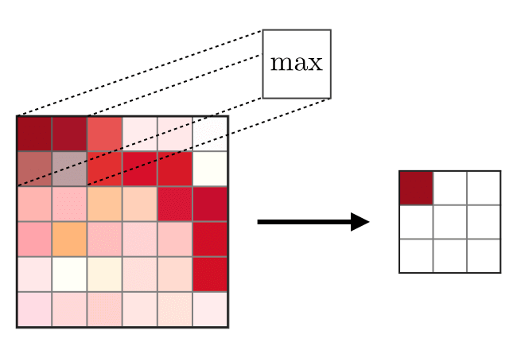
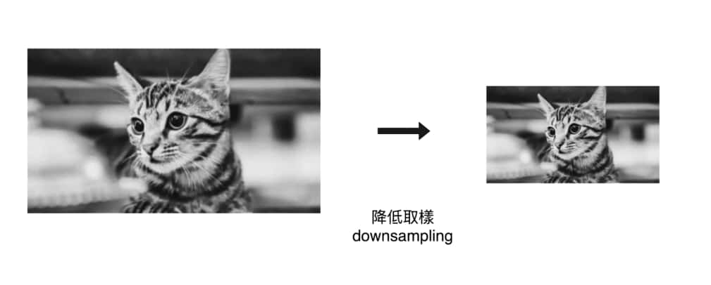

# CNN Introduce-捲積神經網路

## 大綱

### 1.捲積神經網路介紹

### 2.捲積

### 3.池化

### 4.Alexnet 模型

---

## 1.捲積神經網路介紹

卷積神經網路（**C**onvoluational **N**eural **N**etwork, 後簡稱為 CNN)是一種神經網路架構，近年在人臉辨識、圖像分類、自動駕駛等領域大放異彩。本篇供你互動的貓狗辨識應用便是基於此所建立的。

---

## 2.捲積

---

### 2.1 捲積核 -kernel 

定義:  提取特徵的矩陣, 一般為2維矩陣, 又稱filter

---

### 2.1 捲積核 -kernel 

---

### 2.1 捲積核 -kernel 

除了視覺上的娛樂效果以外，每個濾波器對輸入圖片做的卷積運算事實上是一種[特徵提取（feature extraction）](https://zh.wikipedia.org/wiki/特徵提取)步驟。

不同的濾波器會對圖中所有相同範圍（3 x 3）的像素做不同的轉換，進而從這些像素裡頭提取出：

- 物件輪廓
- 左上突出
- [邊緣線條](https://zh.wikipedia.org/wiki/边缘检测)

---

### 2.2 捲積運算

卷積就是將濾波器裡頭的每個數字拿去跟圖片對應位置的像素值相乘，再把所有相乘結果加起來

---

### 2.2 捲積運算

---

### 2.2 捲積運算 -edge_dection

http://www.gunniliang.com/notebooks/Delete/git_r/two_month_report/202011_2021_1/11_9_to_11_13_second/code/edge_detection.ipynb

----

### 2.2 捲積運算-係數更新

隨機初始化所有濾波器的數值，並利用平常訓練神經網路的反向傳播算法（Backpropagation），讓 CNN 自己學出一組有用的濾波器數值來將輸入圖片（一大堆像素）轉換成我們想要的值（ex:一個貓咪機率）。

---

### 3.池化

目的:降低取樣, 減低運算複雜度

Average-pooling: 取均值

Max-pooling: 取最大值

---

### 3.池化-過程

---

### 3.池化--效果

直觀來說，一個 2 x 2 的池化運算能讓我們在不影響物體的情況下，將原圖大小縮減到原來的 25 %。

---

### 3.池化 -Example

http://www.gunniliang.com/notebooks/Delete/git_r/two_month_report/202011_2021_1/11_9_to_11_13_second/code/pooling_ex.ipynb

---

### 捲積網路概略整理:

- CNN 是一個利用卷積與池化對輸入圖片做特徵擷取的神經網路架構
- 對圖片做卷積是有意義的數據轉換是因為：                                    
  - 很多圖形 pattern 尺寸比原圖小很多
  - 同樣 pattern 會重複出現在很多地方
- 對圖片做池化是有意義的數據轉換是因為：                                    
  - 對像素降低取樣並不會改變圖中物件
  - 減少神經網路所需處理的數據量
- 卷積後常跟著池化運算，而你可以重複做（卷積 -> 池化）步驟多次來萃取圖片特徵
- 最後得到的圖片特徵可以交給 CNN 裡的全連接層，由它為我們做（貓狗）分類
- CNN 裡的卷積、池化扮演著萃取特徵的角色，而全連接層則扮演著分類器的角色

---

### 4.Alexnet 模型

---

ref

