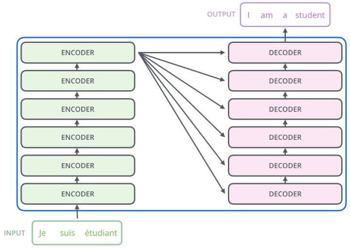
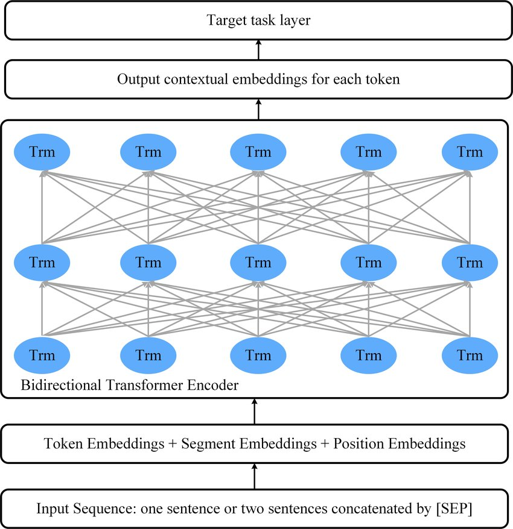
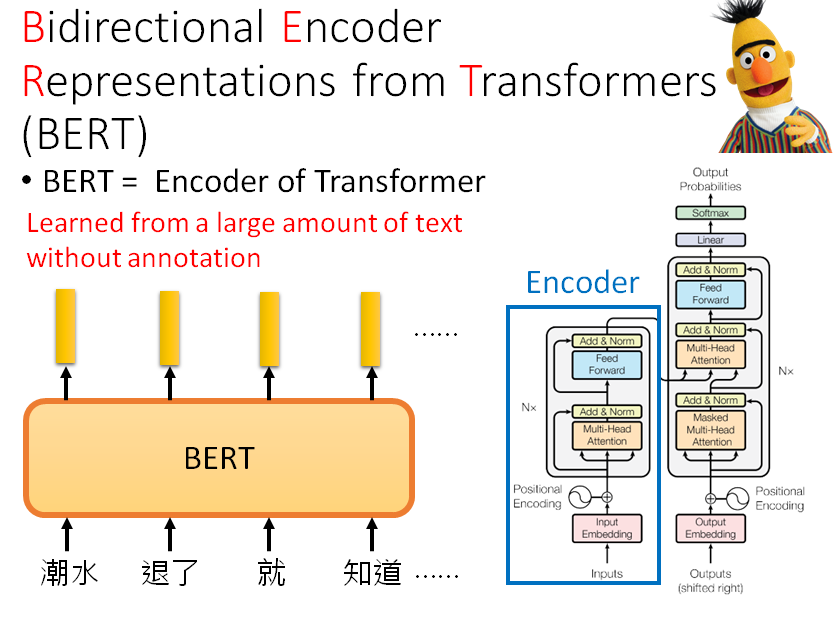

# Bidirectional Encoder Representations from Transformers (BERT) Introduce

## BERT Model - Introduce

2018年bert模型被谷歌提出，它在NLP的11項任務中取得了state of the art 的結果。bert模型是由很多層transformer結構堆疊而成，這里簡單看看一下transformer的結構，上一張經典的圖片，如下：

---

## BERT Model - introduce

transformer是由encoder和decoder模組構成，而bert模型則是利用了transformer的encoder模組。最輕量的bert模型是由12層transformer，12頭注意力，768維的hidden state，結構簡圖如下：

---

## BERT Model - introduce

---

## BERT Model - 輸入

bert 模型的輸入可以是一個句子或者句子對，code層面來說，就是輸入了句子或者句子對對應的3個向量。它們分別是token embedding，segment embedding和position embedding，具體的含義：

token embedding：句子的詞向量

segment embedding：是那個句子的0和1

position embedding：位置向量，指明每個字在句中的位置。

關於position embedding這里有兩種求法，一種是有相應的三角函數公式得出的，這種是絕對向量；還有一種是學習得到的，這種是相對向量

---

## BERT Model - 訓練流程

這個過程包括兩個任務，一個是Masked Language Model(遮掩語言模型)，另外一個是Next Sentence Prediction(下一句預測)。

Masked Language Model(遮掩語言模型)可以理解為是做完型填空，把語料中15%的詞遮掩掉，來學習詞和詞之間的一些規律；

Next Sentence Prediction就是學習語料中上下文中2個句子之間的關系規律。

通過這2個階段任務的學習，bert就會把文本的語法和語義信息學習到。bert模型中的self-attention機制可以使用文本其他的詞來增強目標詞的語義表示，這也是bert模型吊打其他模型的一個關鍵原因。

---

Demo

https://leemeng.tw/attack_on_bert_transfer_learning_in_nlp.html

---

ref

https://leemeng.tw/attack_on_bert_transfer_learning_in_nlp.html

https://blog.csdn.net/HUSTHY/article/details/105882989

