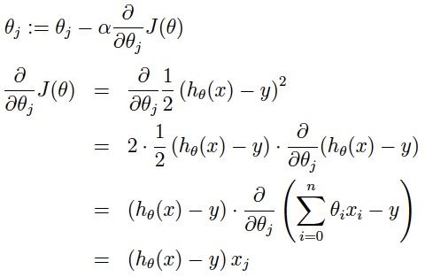
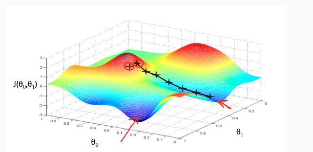
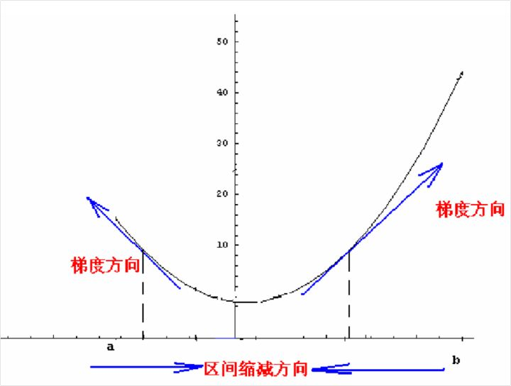
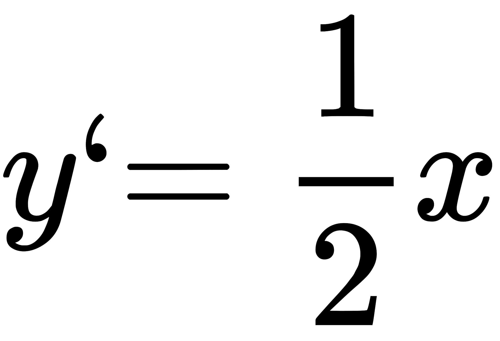
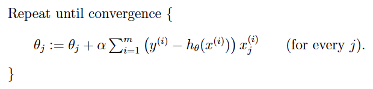
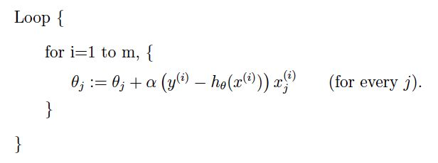
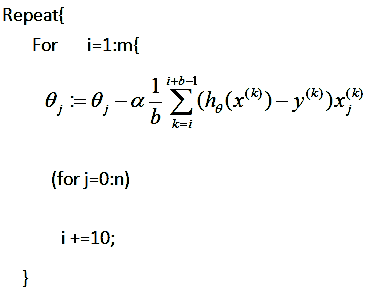

## SGD( Stochastic gradient descent ) 隨機梯度下降

#### 梯度下降法

大多数机器学习或者深度学习算法都涉及某种形式的优化。 优化指的是改变 ![[公式]](./img/x.svg) 以最小化或最大化某个函数 ![[公式]](./img/fx.svg) 的任务。 我们通常以最小化 ![[公式]](./img/fx.svg) 指代大多数最优化问题。 最大化可经由最小化算法最小化 ![[公式]](./img/-fx.svg) 来实现。

我们把要最小化或最大化的函数称为**目标函数或准则**。 当我们对其进行最小化时，我们也把它称为**代价函数、损失函数或误差函数**。

下面，我们假设一个损失函数为 ![[公式]](./img/lossf1.svg) ，其中 ![[公式]](./img/predict_f1.svg) 然后要使得最小化它。

注意：这里只是假设，不用知道这个目标函数就是平方损失函数等等，然后肯定有人问既然要最小化它，那求个导数，然后使得导数等于0求出不就好了吗？Emmmm...是的，有这样的解法，可以去了解正规方程组求解。

说下这里不讲的原因，主要是那样的方式太难求解，然后在高维的时候，可能不可解，但机器学习或深度学习中，很多都是超高维的，所以也一般不用那种方法。总之，梯度下降是另一种优化的不错方式，比直接求导好很多

**梯度下降：**我们知道曲面上方向导数的最大值的方向就代表了梯度的方向，因此我们在做梯度下降的时候，应该是沿着梯度的反方向进行权重的更新，可以有效的找到全局的最优解。这个 ![[公式]](./img/theta_i.svg) 的更新过程可以描述为:

[a表示的是步长或者说是学习率（learning rate）]

好了，怎么理解？在直观上，我们可以这样理解，看下图，一开始的时候我们随机站在一个点，把他看成一座山，每一步，我们都以下降最多的路线来下山，那么，在这个过程中我们到达山底（最优点）是最快的，而上面的a，它决定了我们“向下山走”时每一步的大小，过小的话收敛太慢，过大的话可能错过最小值，扯到蛋...）。这是一种很自然的算法，每一步总是寻找使J下降最“陡”的方向（就像找最快下山的路一样）。

当然了，我们直观上理解了之后，接下来肯定是从数学的角度，我们可以这样想，先想在低维的时候，比如二维，我们要找到最小值，其实可以是这样的方法，具体化到1元函数中时，梯度方向首先是沿着曲线的切线的，然后取切线向上增长的方向为梯度方向，2元或者多元函数中，梯度向量为函数值f对每个变量的导数，该向量的方向就是梯度的方向，当然向量的大小也就是梯度的大小。现在假设我们要求函数的最值，采用梯度下降法，结合如图所示：

如图所示，我们假设函数是 ![[公式]](./img/y_xq_f1.svg) ,那么如何使得这个函数达到最小值呢，简单的理解，就是对x求导，得到  ，然后用梯度下降的方式，如果初始值是（0的左边）负值,那么这是导数也是负值，用梯度下降的公式，使得x更加的靠近0,如果是正值的时候同理。**注意：这里的梯度也就是一元函数的导数，高维的可以直接类推之**

**然后是优缺点，这里比较对象是批量梯度和mini-batch梯度下降，先看下他们三者：**

批量梯度下降：在每次更新时用所有样本，要留意，在梯度下降中，对于 ![[公式]](./img/theta_i.svg) 的更新，所有的样本都有贡献，也就是参与调整 ![[公式]](./img/theta.svg) .其计算得到的是一个标准梯度，**对于最优化问题，凸问题，**也肯定可以达到一个全局最优。因而理论上来说一次更新的幅度是比较大的。如果样本不多的情况下，当然是这样收敛的速度会更快啦。但是很多时候，样本很多，更新一次要很久，这样的方法就不合适啦。下图是其更新公式

随机梯度下降(SGD)：在每次更新时用1个样本，可以看到多了随机两个字，随机也就是说我们用样本中的一个例子来近似我所有的样本，来调整*θ*，因而随机梯度下降是会带来一定的问题，因为计算得到的并不是准确的一个梯度，**对于最优化问题，凸问题，**虽然不是每次迭代得到的损失函数都向着全局最优方向， 但是大的整体的方向是向全局最优解的，最终的结果往往是在全局最优解附近。但是相比于批量梯度，这样的方法更快，更快收敛，虽然不是全局最优，但很多时候是我们可以接受的，所以这个方法用的也比上面的多。下图是其更新公式：

mini-batch梯度下降：在每次更新时用b个样本,其实批量的梯度下降就是一种折中的方法，他用了一些小样本来近似全部的，其本质就是我1个指不定不太准，那我用个30个50个样本那比随机的要准不少了吧，而且批量的话还是非常可以反映样本的一个分布情况的。在深度学习中，这种方法用的是最多的，因为这个方法收敛也不会很慢，收敛的局部最优也是更多的可以接受！

**最后是收敛性，能收敛吗？收敛到什么地方？**

对于收敛性的问题，知乎上就有这个问题：[为什么随机梯度下降方法能够收敛？](https://www.zhihu.com/question/27012077)，我比较赞赏[李文哲博士的回答](https://www.zhihu.com/question/27012077/answer/122359602)（推荐一看），总的来说就是从expected loss用特卡洛（monte carlo）来表示计算，那batch GD, mini-batch GD, SGD都可以看成SGD的范畴。因为大家都是在一个真实的分布中得到的样本，对于分布的拟合都是近似的。那这个时候三种方式的梯度下降就都是可以看成用样本来近似分布的过程，都是可以收敛的！

**于收敛到什么地方：**

能到的地方：最小值，极小值，鞍点。这些都是能收敛到的地方，也就是梯度为0的点。

当然，几乎不存在找到鞍点的可能，除非很碰巧，因为梯度下降是对损失函数每个维度分别求极小值，即分别求 ![[公式]](img/j_theta.svg) 关于 ![[公式]](img/theta_list.svg) 极小值。

然后是最小值和极小值，如果是**凸函数**，梯度下降会收敛到最小值，因为只有一个极小值，它就是最小值。

> 至于什么是凸函数，详见我的专栏文章：[掌握机器学习数学基础之凸优化](https://zhuanlan.zhihu.com/p/30486793)。

**对于理论支持：**

Optimization Methods for Large-Scale Machine Learning：这论文之前的问答也看到了，贴下知友的翻译。[为什么我们更宠爱“随机”梯度下降？](https://zhuanlan.zhihu.com/p/28060786)

ROBUST STOCHASTIC APPROXIMATION APPROACH TO STOCHASTIC PROGRAMMING

An Introduction to optimization

作者：Evan
链接：https://www.zhihu.com/question/264189719/answer/291167114
来源：知乎
著作权归作者所有。商业转载请联系作者获得授权，非商业转载请注明出处。